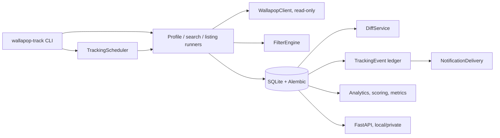

# Wallapop Tracker

**Read-only marketplace monitoring and deal intelligence for authorized public Wallapop data.**

Wallapop Tracker watches public Wallapop profiles, saved searches and individual listings; stores
their history in SQLite; derives changes; explains why a listing matched or failed a search; scores
deals in context; and delivers deduplicated alerts through webhook, Discord and Telegram. It never
writes to Wallapop: no purchases, no messages, no listing edits.

| | |
| --- | --- |
| Version | `1.0.0` |
| Python | `>=3.12` |
| Interfaces | `wallapop-track` CLI, local/private FastAPI service, Prometheus-compatible `/metrics` |
| Storage | SQLite local or PostgreSQL via SQLAlchemy 2, Alembic migrations `0001`–`0022` |
| Status | Private repository, MIT licensed — see [Release status](#release-status) |

## What it does

- Tracks public profiles and their historical metrics (rating, reviews, published, sales, sold,
  reports received). `reports_received` is an observed public Wallapop metric; `0` is distinct
  from unknown and the value does not indicate fraud, trustworthiness or seller quality.
- Tracks saved searches with query, price bounds, structured filters and a per-search interval.
- Deduplicates new-listing and price-change alerts globally across overlapping searches, including
  across process restarts.
- Tracks individual listings with their own interval, target price, percentage-drop and deal-score
  alerts.
- Parses profile, stats, reviews, item, search and metadata payloads through fixture-backed parsers.
- Detects changes deterministically: new, removed and reappeared listings; price, title, reservation,
  shipping, brand and condition changes; profile metric changes.
- Detects explicitly sold listings, and heuristic possible relistings without merging identities.
- Reports read-only market analytics (summary, prices, activity, sellers, brands) and contextual deal
  scores.
- Persists and retries notification deliveries per channel, with secrets redacted from logs.
- Exposes a FastAPI transport layer plus `/health`, `/ready` and Prometheus `/metrics`.
- Runs one-shot, scheduled or manual tracking through a bounded-concurrency scheduler.

## Contents

- [Quick start](#quick-start)
- [First safe demo](#first-safe-demo)
- [Common CLI commands](#common-cli-commands)
- [Configuration](#configuration)
- [Testing and CI](#testing-and-ci)
- [Docker](#docker)
- [Troubleshooting](#troubleshooting)
- [Limitations](#limitations)

## Quick start

### 1. Install

```bash
git clone https://github.com/vgvr0/wallapop-tracker.git
cd wallapop-tracker
python -m venv .venv
# Linux/macOS: source .venv/bin/activate
# Windows PowerShell: .venv\Scripts\Activate.ps1
python -m pip install -e ".[dev]"
```

### 2. Create the schema before the first run

```bash
export WALLAPOP_TRACKER_DB_URL=sqlite:///data/wallapop_tracker.db   # optional; this is the default
mkdir -p data                                                       # PowerShell: New-Item -ItemType Directory -Force data
alembic upgrade head
```

In Windows PowerShell use `$env:WALLAPOP_TRACKER_DB_URL = "sqlite:///data/wallapop_tracker.db"`
instead of `export`.

Apply migrations before the first CLI or API start. The application can also create missing tables
from SQLAlchemy metadata, but such a database has no `alembic_version` row, so `GET /ready` reports
`503` until it is stamped with `alembic stamp head`. Do not run `alembic upgrade head` against a
database the application created that way: SQLite DDL is not transactional, the migration fails
half-way and leaves a misleading revision behind.

### 3. Confirm the installation without live requests

```bash
wallapop-track --help
pytest
```

The default test command excludes opt-in live tests and uses checked-in fixtures. The tracking
commands below contact Wallapop and are not part of the safe installation check.

## First safe demo

```bash
mkdir -p data                    # PowerShell: New-Item -ItemType Directory -Force data
alembic upgrade head
wallapop-track --help
wallapop-track list
pytest
```

To check the local API, run `uvicorn wallapop_tracker.api.app:app --host 127.0.0.1 --port 8000` in
another terminal and request `/health`, `/ready`, `/metrics` and `/docs`. Read endpoints use the
local database and do not request Wallapop data.

### 4. First tracking commands

```bash
wallapop-track add https://es.wallapop.com/user/<profile> --alias seller
wallapop-track list
wallapop-track run seller
wallapop-track search add --name "iphone 15 pro" --query "iphone 15 pro" --max-price 650
wallapop-track search run-all
```

### 5. REST API (local/private)

```bash
uvicorn wallapop_tracker.api.app:app --host 127.0.0.1 --port 8000
curl http://127.0.0.1:8000/health     # {"status":"ok"}
curl http://127.0.0.1:8000/ready      # 200 only when the schema is at the Alembic head
curl http://127.0.0.1:8000/metrics
```

Interactive API documentation is served at `/docs`; the endpoint reference is
[`docs/api.md`](docs/api.md).

### 6. Docker

The image installs the package into a Python 3.12 slim base and runs as the non-root `app` user. Its
default process is the FastAPI service. The checked-in Compose file also starts PostgreSQL and two
worker services; it is not the SQLite quick-start path:

```text
uvicorn wallapop_tracker.api.app:app --host 0.0.0.0 --port 8000
```

```bash
docker build -t wallapop-tracker .
docker compose config
docker compose up -d --build                          # migrates DB, then API on :8000 and workers
docker compose run --rm tracker wallapop-track list    # CLI instead of the default process
curl http://localhost:8000/health
curl http://localhost:8000/ready
```

`docker-compose.yml` publishes port `8000`, defaults `WALLAPOP_TRACKER_DB_URL` to its PostgreSQL
service, and defines a one-shot `migrate`, `tracker`, `scheduler` and `notification-worker` service.
The `./data` mount is kept for local artifacts and the named `postgres-data` volume preserves the
database across `docker compose down` / `up` (do not use `down -v` unless you intend to delete it).
To apply migrations manually, use `docker compose run --rm migrate`; the normal `up` flow applies
them automatically before the API and workers start. `/ready` is expected to return `200` only
after the migration service reaches Alembic head. Stop services with `docker compose down`.

For a local runtime smoke test without Wallapop traffic, run:

```bash
python scripts/validate_docker_release.py
```

The smoke test builds the image, starts Compose, validates health/readiness/metrics/docs and the
CLI, checks restart persistence, and cleans up containers without deleting volumes.

## Security and deployment scope

- **REST API for local/private deployments.** No authentication or authorization is implemented: bind
  it to localhost or a trusted network, put your own access control in front of it, and do not publish
  it as an internet-facing API.
- **Wallapop access is read-only** and relies on internal/undocumented endpoints, so the project is
  intended for authorized, moderate-volume monitoring rather than mass scraping.
- **Secrets stay in the environment.** Delivery destinations, tokens and headers are read from
  environment variables and redacted from logs and stored delivery errors. `.env` is git-ignored and
  `.env.example` lists names with placeholder defaults only.
- **The API serves local data.** Serving read queries performs no Wallapop request.

## Configuration

These are the only variables read by the code. All are optional and have a working default except the
destinations of the channels you explicitly enable.

| Variable | Default | Purpose |
| --- | --- | --- |
| `WALLAPOP_TRACKER_DB_URL` | `sqlite:///data/wallapop_tracker.db` | SQLAlchemy URL used by the CLI, the API and `alembic` |
| `WALLAPOP_LOG_LEVEL` | `INFO` | Standard logging level |
| `WALLAPOP_LOG_FORMAT` | `human` | `human` or `json` structured logging |
| `WALLAPOP_METRICS_ENABLED` | `true` | Enables `/metrics` and HTTP request metrics |
| `WALLAPOP_NOTIFY_WEBHOOK_ENABLED` | `false` | Enables the generic webhook channel |
| `WALLAPOP_NOTIFY_DISCORD_ENABLED` | `false` | Enables the Discord webhook channel |
| `WALLAPOP_NOTIFY_TELEGRAM_ENABLED` | `false` | Enables the Telegram Bot API channel |
| `WALLAPOP_WEBHOOK_URL` | — | Webhook destination, required to enable the webhook channel |
| `WALLAPOP_WEBHOOK_HEADERS` | `{}` | Optional JSON object of extra webhook headers |
| `WALLAPOP_DISCORD_WEBHOOK_URL` | — | Discord destination, required to enable Discord |
| `WALLAPOP_TELEGRAM_BOT_TOKEN` | — | Telegram bot token, required to enable Telegram |
| `WALLAPOP_TELEGRAM_CHAT_ID` | — | Telegram chat ID, required to enable Telegram |
| `WALLAPOP_NOTIFICATION_MAX_ATTEMPTS` | `3` | Delivery attempt limit before a delivery is left failed |
| `TELEGRAM_BOT_TOKEN`, `TELEGRAM_CHAT_ID` | — | Legacy aliases for the two Telegram variables above |
| `WALLAPOP_TEST_PROFILE_URL` | — | Opt-in profile URL for `pytest -m live` |
| `WALLAPOP_E2E_PROFILE_URL_1`, `WALLAPOP_E2E_PROFILE_URL_2` | — | Profile URLs required by `scripts/run_e2e_validation.py` |
| `WALLAPOP_WORKER_ID` | generated | Optional identity used by worker lease code |
| `WALLAPOP_JOB_LEASE_SECONDS` | `900` | Tracking job lease duration in seconds |
| `WALLAPOP_NOTIFICATION_LEASE_SECONDS` | `300` | Notification delivery lease duration in seconds |

See [`.env.example`](.env.example). HTTP client options such as base URLs, timeout, retry limits,
rate-limit interval, user agent and RAW capture directory are Python constructor arguments, not
environment variables.

## Common CLI commands

```bash
# Profiles
wallapop-track add https://es.wallapop.com/user/<profile> --alias seller [--notes "..."]
wallapop-track list | enable seller | disable seller | remove seller --yes
wallapop-track run seller | run-all
wallapop-track schedule --once [--interval-hours 168 --poll-seconds 60 --max-concurrency 4]

# Searches
wallapop-track search add --name "iphone 15 pro" --query "iphone 15 pro" --max-price 650 \
  --include 256gb --exclude roto --title-include iphone --description-exclude "para piezas" \
  [--notify-on-first-run] [--interval-seconds 600] [--category-id 24200]
wallapop-track search import "https://es.wallapop.com/app/search?keywords=iphone+15&max_sale_price=650" \
  --name "iPhone 15"
wallapop-track search list | show 1 | update 1 --title-exclude carcasa | run 1 | run-all
wallapop-track search explain 1 42 [--json]
wallapop-track search alerts set 1 --percentage-drop 10 --notify-30d-low

# Listings
wallapop-track listing add https://es.wallapop.com/item/<slug>-<id> --alias camera
wallapop-track listing list | show camera | run camera | enable camera | remove camera --yes
wallapop-track listing alerts set camera --target-price 250 --deal-score-threshold 70

# Read-only insight
wallapop-track analytics market 1 [--json] | prices 1 | activity 1 --weekly | sellers 1 | brands 1
wallapop-track score listing 42 --search-id 1 | score search 1 [--limit 20]
wallapop-track relistings list --min-score 0.75 | relistings show 1

# Notifications and metadata
wallapop-track notify [--dry-run] | notifications list | notifications retry
wallapop-track metadata categories | filters --query iphone [--category-id 24200] | brands | models

# PostgreSQL worker commands (only when that workstream is present)
wallapop-track worker tracking | worker notifications
```

New searches suppress `NEW_LISTING` on their first valid run unless `--notify-on-first-run` is given.
Metadata commands are read-only and use discovery endpoints validated by RAW fixtures. The complete
command reference is [`docs/cli.md`](docs/cli.md).

## Search filters

Tracked searches store their structured filters as validated JSON; the CLI, the REST API and the
repository accept the same keys, and every configured filter is combined with AND:

| Filter | Scope | Behaviour |
| --- | --- | --- |
| `min_price`, `max_price` | price | Inclusive bounds |
| `include` / `include_mode` | title + description | Legacy combined search, ANY (default) or ALL |
| `exclude` | title + description | Rejects the listing when any term appears |
| `title_include`, `description_include` | title / description | Requires every or at least one term, per mode |
| `title_exclude`, `description_exclude` | title / description | Rejects the listing when any term appears |
| `title_first_word_include`, `title_first_word_exclude` | first title word | Exact match on the normalized first word |
| `condition`, `category_id`, `brand`, `model`, `distance` | listing attributes | Structured filters |
| `regex` / `regex_target` | title, description or both | Regular-expression filter |

Matching is case-insensitive and whitespace-tolerant, accents are not folded, the stored text is never
modified, and an exclude always wins over an include of the same term. Description filters use the
description carried by the search payload; no per-listing detail request is issued. Exact semantics,
aliases, evaluation order and first-word rules are documented in
[`docs/search_tracking_design.md`](docs/search_tracking_design.md#filtros-avanzados-de-texto).

### Filter explanations

`FilterEngine.matches(listing)` keeps returning a short-circuiting `bool`. The same engine can explain
a verdict with `evaluate(listing)`, which never short-circuits and returns one trace per configured
filter with three states: PASS (`True`), FAIL (`False`) and UNKNOWN (`None`, not enough data). The
global verdict follows from the traces: a known failure wins over an unknown condition, and an unknown
condition prevents asserting a match. Traces are runtime diagnostics and are never persisted.

```bash
wallapop-track search explain 1 42            # human-readable traces
wallapop-track search explain 1 42 --json     # structured payload
```

`GET /api/v1/searches/{id}/listings/{listing_id}/explain` exposes the same explanation. Trace design
and the storage-artifact rules (such as `model` and distance traces being UNKNOWN when rebuilding from
persisted snapshots) are documented in
[`docs/search_tracking_design.md`](docs/search_tracking_design.md#explicación-de-matching-traces).

## Architecture



Profiles, searches and tracked listings share one listing identity, one event ledger and one
notification queue. A valid capture is persisted in a single transaction; partial and failed captures
keep their diagnostic run metadata and never overwrite the last valid state.

Background reading: [`docs/architecture.md`](docs/architecture.md),
[`docs/database-schema.md`](docs/database-schema.md),
[`docs/history-architecture.md`](docs/history-architecture.md),
[`docs/tracking_run_model.md`](docs/tracking_run_model.md).

## Documentation map

| Document | Contents |
| --- | --- |
| [`docs/cli.md`](docs/cli.md) | Complete CLI command reference |
| [`docs/api.md`](docs/api.md) | FastAPI endpoints, filters payload, error model, private scope |
| [`docs/observability.md`](docs/observability.md) | Logging, `/health`, `/ready`, metrics and their limits |
| [`docs/search_tracking_design.md`](docs/search_tracking_design.md) | Search tracking, advanced text filters, filter traces |
| [`docs/search_url_import.md`](docs/search_url_import.md) | Search URL import and unsupported parameters |
| [`docs/search_baseline.md`](docs/search_baseline.md) | First-run notification baseline per search |
| [`docs/search_provider_architecture.md`](docs/search_provider_architecture.md) | Search provider abstraction |
| [`docs/notification_architecture.md`](docs/notification_architecture.md) | Event vs delivery, idempotency, retries, channels |
| [`docs/alert_architecture.md`](docs/alert_architecture.md) | Alert routing and the event ledger |
| [`docs/advanced_alerts.md`](docs/advanced_alerts.md) | Advanced alert rules and thresholds |
| [`docs/market_analytics.md`](docs/market_analytics.md) | Market summaries, series, seller and brand stats |
| [`docs/deal_scoring.md`](docs/deal_scoring.md) | Score signals, confidence and persistence |
| [`docs/seller-reputation.md`](docs/seller-reputation.md) | Descriptive seller metrics, peer context and limitations |
| [`docs/relisting_detection.md`](docs/relisting_detection.md) | Relisting signals, score and candidate status |
| [`docs/tracked_listing_architecture.md`](docs/tracked_listing_architecture.md) | Direct listing monitoring lifecycle |
| [`docs/sold-listing-detection.md`](docs/sold-listing-detection.md) | Explicit sold detection |
| [`docs/tracking-semantics.md`](docs/tracking-semantics.md) | Presence and listing state semantics |
| [`docs/condition-discovery.md`](docs/condition-discovery.md) | Product condition codes and labels |
| [`docs/discovery_endpoints.md`](docs/discovery_endpoints.md) | Read-only metadata discovery endpoints |
| [`docs/scheduler_concurrency.md`](docs/scheduler_concurrency.md) | Bounded scheduler concurrency |
| [`docs/multi_marketplace_architecture.md`](docs/multi_marketplace_architecture.md) | Marketplace-scoped identity preparation |
| [`docs/api-stability.md`](docs/api-stability.md) | Upstream endpoint stability strategy |
| [`docs/architecture.md`](docs/architecture.md) | Historical persistence architecture |
| [`docs/database-schema.md`](docs/database-schema.md) | Historical schema design |
| [`docs/history-architecture.md`](docs/history-architecture.md) | Historical model responsibilities |
| [`docs/tracking_run_model.md`](docs/tracking_run_model.md) | `TrackingRun` model and outcomes |
| [`docs/stats-vs-reviews.md`](docs/stats-vs-reviews.md), [`docs/research.md`](docs/research.md) | Capture research and validation notes |
| [`docs/platform_evolution_plan.md`](docs/platform_evolution_plan.md), [`docs/platform_evolution_summary.md`](docs/platform_evolution_summary.md) | Evolution plan and summary |

## Project layout

```text
.
├── src/wallapop_tracker/
│   ├── client.py        # Async read-only HTTP client
│   ├── cli.py           # Typer application (wallapop-track)
│   ├── api/             # FastAPI transport layer
│   ├── parsers/         # Response normalization
│   ├── providers/       # Search and listing providers
│   ├── services/        # Tracking, runners, scheduler, diff, alerts, notifications
│   ├── reporting/       # Historical queries, market analytics, metrics
│   ├── storage/         # SQLAlchemy models, database, repositories
│   └── domain/          # Filters, alerts, scoring, marketplace, relisting rules
├── alembic/             # Versioned schema migrations (0001–0022)
├── tests/               # Unit, contract, integration-style and opt-in live tests
├── scripts/             # Manual E2E and fixture validation utilities
├── docs/                # Design and operational documentation
├── Dockerfile, docker-compose.yml
└── pyproject.toml
```

## Testing and CI

```bash
pytest          # offline suite; the default marker excludes live tests
ruff check .
ruff format --check .
mypy src
```

`pytest` is the offline/default suite. `pytest -m live` selects explicitly marked live tests and
requires `WALLAPOP_TEST_PROFILE_URL`; it contacts Wallapop and should only be run with an authorized,
read-only, moderate-volume test profile. The default `addopts` excludes that marker. CI
(`.github/workflows/ci.yml`) runs Ruff, format check, mypy and pytest on Python 3.12 for pushes
and pull requests without Wallapop network access, because parser contracts are covered by checked-in
RAW fixtures in `tests/fixtures/raw/`. Live tests are opt-in (`pytest -m live` with
`WALLAPOP_TEST_PROFILE_URL`), and `scripts/run_e2e_validation.py` stores its history separately in
`data/e2e_validation.db`.

## Limitations

- The Wallapop integration depends on internal/undocumented endpoints and frontend response shapes that
  may change without notice.
- Read-only by design: no purchases, messages, listing edits or any other write action.
- Intended for authorized, moderate-volume monitoring, not for mass scraping.
- Search results are limited to a configurable recent-page window (`max_pages`, default five) instead
  of an exhaustive historical search.
- Notification delivery is sequential and has no distributed queue or concurrent worker pool.
- Multiple scheduler processes are not coordinated; SQLite file databases use WAL plus a busy timeout.
- Listing detail depends on the observed `/api/v3/items/{id}` endpoint and is covered by offline
  fixtures only.
- No authentication: keep the API private, as described in
  [Security and deployment scope](#security-and-deployment-scope).

## Troubleshooting

- `alembic` or `wallapop-track` is not recognized: activate `.venv`, or invoke the executable from
  `.venv/bin/` (Linux/macOS) or `.venv\Scripts\` (Windows), then rerun `python -m pip install -e ".[dev]"`.
- `unable to open database file`: create the parent directory before `alembic upgrade head`.
- `/ready` returns `503`: run `alembic upgrade head` against the same `WALLAPOP_TRACKER_DB_URL`.
- Notification startup rejects Telegram or webhook settings: keep the channel disabled, or provide
  its matching destination variables; Telegram also accepts the documented legacy aliases.
- HTTP `429` from Wallapop: stop the live command, reduce polling/page volume and retry later; do not
  add bypasses. Upstream contract/schema changes require fixture and parser review.
- `pytest -m live` skips a test: set `WALLAPOP_TEST_PROFILE_URL`; plain `pytest` intentionally skips
  live tests.

## Release status

- `1.0.0` covers the features above as a stable private release: tracking, parsers, storage, diffing,
  filters and explanations, alerts, notifications, analytics, scoring, relisting detection, CLI,
  local/private API, Alembic migrations, Docker packaging, tests and CI.
- **Naming:** the repository is `wallapop-tracker`, the Python distribution is
  `wallapop-profile-tracker`, the import package is `wallapop_tracker` and the CLI entry point is
  `wallapop-track`. The distribution name is intentionally unchanged in this release: it is not
  published on PyPI and nothing in the repository depends on the name beyond `pip install`, so
  renaming it to match the repository stays a separate, deliberate decision.
- **License:** MIT; see [`LICENSE`](LICENSE).
- **Screenshots:** none. There is no UI, so the recommended captures are manual: the CLI,
  `search explain`, FastAPI `/docs` and `/metrics`.
- **Out of scope for this release:** Git tag, GitHub release, dashboard, MCP server, authentication,
  new filters, new alerts and additional scraping.
- **Optional Telegram control:** run `wallapop-track telegram-bot` with
  `WALLAPOP_TELEGRAM_BOT_TOKEN`; see [`docs/telegram-control-bot.md`](docs/telegram-control-bot.md).
