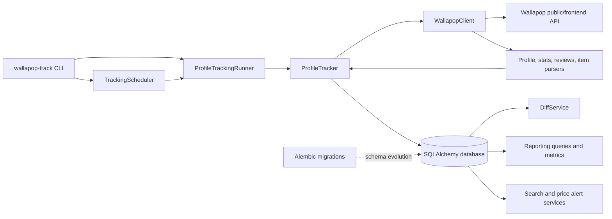

# Wallapop Profile Tracker

Wallapop Profile Tracker is a read-only tracker for authorized monitoring of public Wallapop profiles. It resolves profile identities, captures profile metrics and listings, and stores their history locally. Valid captures support deterministic change detection for listing appearance, disappearance, reappearance, price changes, and profile metrics, together with queryable reports and alert services. A sequential scheduler can run enabled profiles at a configurable interval.

## Key features

- Asynchronous HTTP client for public profile, statistics, review-summary, listing, and search data.
- Profile URL resolution through the public profile page or a locally recognizable canonical ID.
- Cursor-based listing pagination with duplicate and repeated-cursor protection.
- Historical SQLite/SQLAlchemy storage for profiles, listings, tracking runs, presence, and snapshots.
- Valid, partial, and failed tracking-run outcomes with component-level capture flags.
- Deterministic diffing for new, removed, and reappeared listings; prices; titles; reservation; shipping; brand; rating; review count; and sold count.
- Read-only reporting queries for current inventory, inventory history, price history, presence history, profile metrics, active duration, and weekly summaries.
- Internal alert services for new saved-search matches and listing price drops.
- Conservative rate limiting, retries, `Retry-After` handling, and optional RAW response capture for contract investigation.
- Typer CLI for tracked-profile administration, manual runs, batch runs, and scheduling.
- Alembic migrations for the historical schema and alert-related tables.

## Architecture



The client performs extraction asynchronously. The tracker coordinates a profile capture and persists it atomically when all required components are available. The runner updates tracked-profile scheduling metadata, while the scheduler selects enabled profiles that are due and executes them sequentially.

## Project structure

```text
.
├── src/wallapop_tracker/
│   ├── client.py             # Async read-only HTTP client
│   ├── cli.py                # Typer application
│   ├── parsers/              # API response normalization
│   ├── services/             # Tracking, running, scheduling, diffing, alerts
│   ├── reporting/            # Historical queries and derived metrics
│   ├── storage/              # SQLAlchemy models, database, repositories
│   └── domain/               # Change and alert value objects
├── alembic/                  # Versioned schema migrations
├── tests/                    # Unit, contract, integration-style, and live tests
├── scripts/                  # Manual E2E and fixture validation utilities
├── Dockerfile
├── docker-compose.yml
└── pyproject.toml
```

## Installation

```bash
git clone <repository-url>
cd wallapop-tracker
python -m venv .venv
pip install -e ".[dev]"
```

The package requires Python 3.12 or newer. The default database URL is `sqlite:///data/wallapop_tracker.db`; the `data/` directory is created when the CLI initializes the database.

## CLI usage

The installed entry point is `wallapop-track`.

```bash
wallapop-track add https://es.wallapop.com/user/<profile> --alias seller
wallapop-track list
wallapop-track run seller
wallapop-track run-all
wallapop-track enable seller
wallapop-track disable seller
wallapop-track remove seller --yes
wallapop-track schedule --once
wallapop-track schedule --interval-hours 168
```

`add` accepts an optional `--notes` value and resolves/checks the profile before creating the tracked-profile record. Aliases are normalized to lowercase. `remove` asks for confirmation unless `--yes` is supplied. `run-all` processes enabled profiles and prints a summary of `valid`, `partial`, and `failed` outcomes.

The scheduler also accepts `--poll-seconds` (default: `60`). Without `--once`, it keeps polling until interrupted. `schedule --once` evaluates and executes due profiles once, then exits.

## Scheduling

Scheduling operates on tracked profiles with `enabled = true`. A profile is due when it has never run or when its `last_run_at` is at least the configured interval in the past. The runner writes the attempt time and resulting status back to the tracked-profile record.

Profiles are executed sequentially. A failure is recorded for the affected profile and does not prevent later due profiles from being attempted. Scheduler and tracking timestamps are handled in UTC; naive input datetimes are normalized to UTC. The interval is configured with `--interval-hours` and defaults to 168 hours (one week). `--once` performs a single due-profile evaluation, which is useful for one-shot jobs and external schedulers.

## Historical model

- **Profiles** represent the normalized Wallapop identity and stable profile attributes.
- **Tracked profiles** are user-managed configurations with a profile URL, unique alias, enabled flag, notes, and scheduling metadata.
- **Tracking runs** record each capture attempt, timestamps, status, fetched-item counts, component success flags, and errors. Terminal statuses are `valid`, `partial`, and `failed`.
- **Listings** represent normalized Wallapop items associated with a profile.
- **Profile snapshots** store change-based profile metrics such as rating, review count, published count, purchases, sales, sold count, reports, and rating distribution.
- **Listing snapshots** store change-based listing fields such as title, price, status, reservation, shipping, brand, condition, and source timestamps.
- **Presence rows** associate listings with valid runs. Listing snapshots use `ACTIVE` or `REMOVED` to preserve lifecycle state.

Snapshots are written only for valid runs. Partial or failed captures are retained as run outcomes but cannot establish new profile/listing presence or overwrite the last valid historical state.

The repository contains Alembic revisions `0001` through `0006` covering the historical schema, presence and lifecycle fields, profile/listing field extensions, tracked profiles, saved searches, and price watches. The CLI currently initializes tables through SQLAlchemy metadata (`create_all`); Alembic is available for explicit schema migration workflows.

## Change detection

`DiffService` compares valid runs for the same profile and derives:

- new listings;
- removed listings;
- listings that reappeared after an absent run;
- price, title, reservation, shipping-availability, and brand changes;
- profile rating, review-count, and sold-count changes.

Presence is derived from the listing-to-run association rather than from a missing snapshot. Reporting queries expose related inventory, price, presence, and metric histories without modifying the database.

## Reliability

The asynchronous client applies a minimum request interval and serializes rate-limit waits. Transient network and timeout errors are retried. HTTP `429` and `500`, `502`, `503`, and `504` responses use exponential backoff and honor a numeric or HTTP-date `Retry-After` value, capped by the configured maximum. Other HTTP errors are surfaced without retrying.

The tracker distinguishes complete captures from partial and failed captures. A valid capture is persisted in a database transaction; partial and failed captures retain diagnostic run metadata while preserving the last valid historical state. Optional RAW response capture writes response bodies before normalization and treats filesystem failures as warnings.

The parser contract tests use checked-in RAW fixtures under `tests/fixtures/raw/`, so API-shape regressions can be detected without network access. The fixture scripts and manual E2E validation are separate from the default test suite.

## Testing

Install development dependencies and run:

```bash
pytest
ruff check .
mypy src
```

The default pytest configuration excludes tests marked `live`. Live tests are explicitly authorized integration checks and can be selected with `pytest -m live` when `WALLAPOP_TEST_PROFILE_URL` is configured. The manual E2E script requires both `WALLAPOP_E2E_PROFILE_URL_1` and `WALLAPOP_E2E_PROFILE_URL_2` and stores its separate history in `data/e2e_validation.db`.

## CI

GitHub Actions runs on pushes and pull requests using Python 3.12. The workflow installs the package with development dependencies, then runs Ruff, mypy, and pytest. Since the default pytest marker excludes live tests, CI does not require Wallapop network access or live profile URLs.

## Docker

The image installs the package into a Python 3.12 slim image and runs as a non-root `app` user. Docker Compose mounts the local `data/` directory at `/app/data` and passes `WALLAPOP_TRACKER_DB_URL`, defaulting to the SQLite database under that mount.

```bash
docker build -t wallapop-tracker .
docker compose run --rm tracker wallapop-track --help
docker compose run --rm tracker wallapop-track list
```

## Configuration

The application reads the following environment variables:

- `WALLAPOP_TRACKER_DB_URL`: SQLAlchemy database URL used by the CLI. It defaults to `sqlite:///data/wallapop_tracker.db`.
- `WALLAPOP_TEST_PROFILE_URL`: optional profile URL used by the opt-in live pytest.
- `WALLAPOP_E2E_PROFILE_URL_1` and `WALLAPOP_E2E_PROFILE_URL_2`: the two optional profile URLs required by `scripts/run_e2e_validation.py`.

The client itself also accepts runtime options such as base URLs, timeout, retry limits, rate-limit interval, user agent, and an optional RAW data directory through its Python constructor; these are not environment variables.

## Limitations

- The integration relies on internal or undocumented Wallapop endpoints and frontend response shapes, which may change without notice.
- The project is read-only. It does not automate purchases, messages, listing edits, or any other action on Wallapop.
- It is intended for authorized, moderate-volume monitoring, not for mass scraping.
- Search results are intentionally limited to a configurable recent-page window (`max_pages`, default five), rather than being an exhaustive historical search.
- Alert services currently produce domain alert objects; notification delivery and corresponding CLI administration are not implemented.

## Development status

This is a functional technical project with an asynchronous client, normalized parsers, historical persistence, deterministic diffing, reporting queries, alert services, a CLI, scheduling, tests, CI, Docker packaging, and manual E2E validation. Its external API integration remains subject to the limitations above, especially changes to undocumented Wallapop response contracts.
