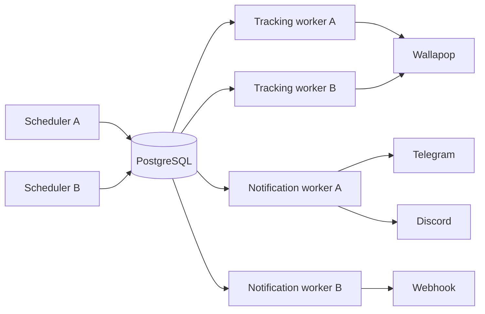

# PostgreSQL production architecture

The previous design used SQLAlchemy 2.x sessions through `Database`, SQLite
foreign keys/WAL/busy timeout, and Python-side due filtering. It was safe in one
process (and functionally safe in threads sharing one process), but not across
processes or hosts: two schedulers could select the same due row. Notification
selection had no persistent claim either. Database constraints already protect
`TrackingEvent` through `uq_tracking_events_idempotency` and deliveries through
`uq_notification_delivery_target`, with `IntegrityError` recovery.

Production uses `WALLAPOP_TRACKER_DB_URL=postgresql+psycopg://...`. PostgreSQL
gets pre-ping, bounded pooling and recycle; SQLite-only PRAGMAs are never used
on PostgreSQL. SQLite remains a local-development fallback and is not claimed
to be distributed-safe.

Tracking sources and notification deliveries use UTC leases. PostgreSQL claim
transactions use `FOR UPDATE SKIP LOCKED`, write `claimed_by` and expiry, then
commit before any HTTP I/O. Expired claims become eligible again after a crash.
`WALLAPOP_JOB_LEASE_SECONDS`, `WALLAPOP_NOTIFICATION_LEASE_SECONDS` and
`WALLAPOP_WORKER_ID` configure TTLs/identity. Alembic is the production schema
mechanism; application startup does not create PostgreSQL tables.

Notification flow is `TrackingEvent -> NotificationDelivery(PENDING) ->
PROCESSING -> DELIVERED/FAILED`, with persistent exponential backoff in
`next_attempt_at` (capped at 30 minutes). Semantics are at-least-once
processing plus idempotent persistence and best-effort external deduplication;
if a provider accepts a request and the process dies before `sent` is stored,
an external duplicate remains possible, so exactly-once is not promised.
